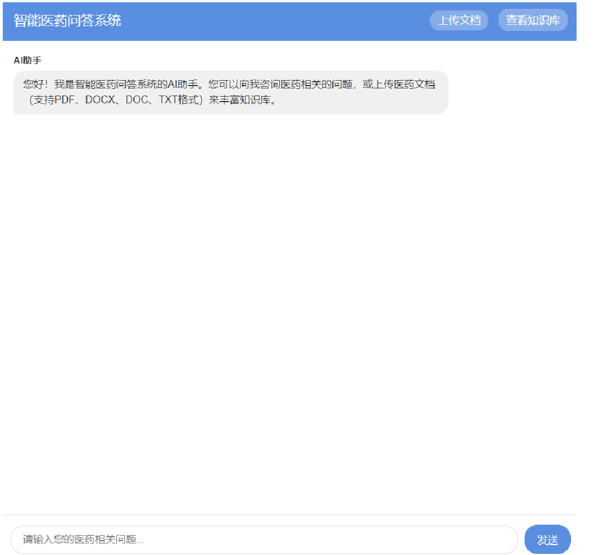
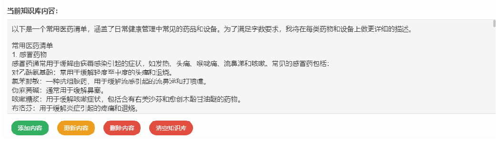

# MedcineRag 医药问答系统

本项目是一个基于 Spring Boot 和 LangChain4j 实现的单点 RAG (Retrieval-Augmented Generation) 医药问答系统。

## 系统功能展示 (程序运行结果)

根据运行结果截图，系统已经能够实现以下功能：
- 展示系统单点实现 RAG
- 构建医药问答知识库
- 知识库可支持多种格式和图片展示等辅助功能
- 实现基于医药问答的智能问答交互

### 运行截图

- 系统界面

- 数据库管理界面

- 测试是否成功导入

- 操作指南

- 功能完成

## 核心接口功能

系统提供了完整的知识库管理和问答接口：

- **智能问答** (`/api/chat` - POST): 支持流式输出（SSE），实时回答用户的医药相关问题。
- **知识库文档上传** (`/api/upload` - POST): 上传文件（支持多种格式与解析），直接更新至知识库。
- **查询知识库** (`/api/knowledge` - GET): 获取当前已被系统索引的知识库内容。
- **添加知识库内容** (`/api/knowledge/add` - POST): 手动添加特定的文本规则或医疗知识到知识库。
- **删除知识库内容** (`/api/knowledge/delete` - DELETE): 根据关键词精确删除指定的知识库内容。
- **更新知识库内容** (`/api/knowledge/update` - PUT): 替换知识库中的旧内容，保持医疗信息最新。
- **清空知识库** (`/api/knowledge/clear` - DELETE): 一键清空所有知识库数据。

## 技术栈
- Backend: Java, Spring Boot
- AI & RAG: LangChain4j (文档解析、向量检索、大模型集成)
